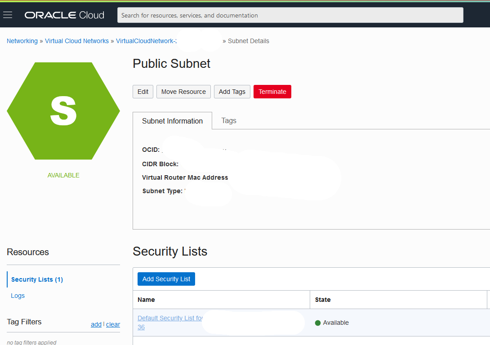
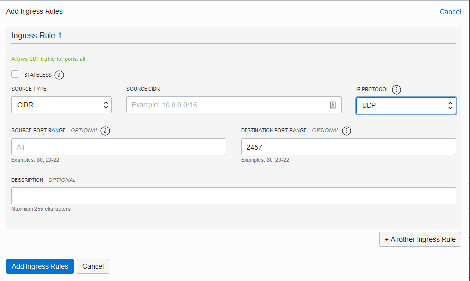

# Oralce-Cloud-Valheim-Game-Server-Setup-for-Free


A more enhanced how-to guide coming soon after I do some testing of different compute configurations. 

### Table of Contents
1. [Sign up for Oracle Cloud Free Tier](#signupfororaclecloudfreetier)
2. [Create The Virtual Machine.](#CreateTheVirtualMachine)
3. [Login to the Virtual Machine](#LogintotheVirtualMachine)
4. [Go ahead and setup the firewall stuff on the server and cloud account](#Goaheadandsetupthefirewallstuffontheserverandcloudaccount)
5. [Install the Linux Game Server Manager(LGSM)](#InstalltheLinuxGameServerManager(LGSM))
6. [OR Install CubeCoders Application Management Panel(AMP)](#ORInstallCubeCodersApplicationManagementPanel(AMP))
7. [Setup your Valheim config file](#Setupyourconfigfile)
8. [Optional - Migrate your world](#Optional:Migrateyourworld)

## Sign up for Oracle Cloud Free Tier
Link: https://www.oracle.com/cloud/free/


- Its a free trial and a free account too. 
- You won't be charged and can still use everal free services after the trail. 
- Plus they nicely label all the free stuff. 
- In this we will use 1 of the 2 free virtual machines. 

## Create The Virtual Machine

Choose the following and make sure to download the SSH keys to login in the next step. This is their free tier VM and should be okay for you and a couple buddies. 


## Login to the Virtual Machine

This will be different for every operating system so check out the offical oracle doc:
https://docs.oracle.com/en-us/iaas/Content/Compute/Tasks/accessinginstance.htm


## Go ahead and setup the firewall stuff on the server and cloud account

Valheim uses the following ports, but could be changed if you want during config. 

Run the following one at a time
```
sudo firewall-cmd --permanent --zone=public --add-port=2456/udp
```
```
sudo firewall-cmd --permanent --zone=public --add-port=2457/udp
```
```
sudo firewall-cmd --reload
```

### You will also need to add the following ports to the ingess rule set






## Install the Linux Game Server Manager(LGSM)
More info here: https://linuxgsm.com/lgsm/vhserver/

### Dependencies install
login
then  type the following to login as root
```
sudo su 
```
Then install the dependencies. Run the following one at a time
```
yum install epel-release
```
```
yum install curl wget tar bzip2 gzip unzip python3 binutils bc jq tmux glibc.i686 libstdc++ libstdc++.i686
```
### Install GameDig
Its a recommended additional module that allows LinuxGSM to gather more info from the game
```
curl -sL https://rpm.nodesource.com/setup_12.x | bash -
```
```
yum install nodejs
```
```
npm install gamedig -g
```
```
npm update -g
```
### Run this since it seems to be left out when installing linux game server manager
```
sudo yum install nmap-ncat
```
### Install LGSM & Use it to install Valheim

The next few steps are pretty easy. 
Create the user 
```
adduser vhserver
```
login as that user
```
su - vhserver
```
2. Download linuxgsm
```
wget -O linuxgsm.sh https://linuxgsm.sh && chmod +x linuxgsm.sh && bash linuxgsm.sh vhserver
```
3. Run the installer following the on-screen instructions.
```
./vhserver install
```
### And done with LGSM install. Now for config and daily use cases. 

### When logged into server as vhserver. Run the following to see all commands:
```
./vhserver
```
### Valheim Basic Server Command stuff
```
./vhserver start
./vhserver stop
./vhserver restart
./vhserver update
./vhserver details
./vhserver backup
./vhserver monitor
```
Once you start the server it will populate with a default config. Check out steps below to migrate your own world. 
___
## OR Install CubeCoders Application Management Panel(AMP)
More info at the link: 
- https://cubecoders.com/AMP
- https://cubecoders.com/AMPInstall
-- note its paid server administration software. But its fairly inexpensive and feature rich. 

### Install AMP 
This is their quick install command. It will walk you through all the steps and is very easy. I skipped the https stuff.
```
bash <(wget -qO- [getamp.sh](http://getamp.sh/))
```
- Also when it asks you to finish the install via AMP login, it shows you the ip/port to go check out. 
- I had to add the port 8080 to my ingess rules like in step 4 above before I could access the panel. 
- You can also skip the license and add that after. 
- Add the license key under Configuration > New Instance Defaults
 
### Install Valheim with AMP
This part is just wonderfully easy. 
- Click Instances > Create Instance 


## Setup your config file
...to be added

## Optional: Migrate your world
...to be added
```
sudo chmod -R ugo+rw /home/vhserver/
```
