# Valheim-Free-Game-Server-Setup-Using-Oracle-Cloud


Hopefully this helps someone get started. The free version will only be good for a couple people. 

But if you want to use your free trial credits or upgrade then I would recommend the following and its pretty much the same setup steps as below: 
| Price | Shape | CPU Core | Memory(GB) | Load Balancer |
| ----------- | ----------- | ----------- | ----------- |  ----------- |
| Free | VM.Standard.E2.1.Micro| 1 | 1 |1 w/ 10mbps|
| Paid(recommended)| VM.Standard.E3.Flex| 1 | 3|1 w/ 10mbps|

### Table of Contents
1. [Sign up for Oracle Cloud Free Tier](#sign-up-for-oracle-cloud-free-tier)
2. [Create The Virtual Machine.](#create-the-virtual-machine)
3. [Login to the Virtual Machine](#login-to-the-cloud-virtual-machine)
4. [Go ahead and setup the firewall stuff on the server and cloud account](#go-ahead-and-setup-the-firewall-stuff-on-the-server-and-cloud-account)
### Valheim Install Method 1
5. [Method 1: Install the Linux Game Server Manager(LGSM)](#method-1-install-the-linux-game-server-managerlgsm)
### Or Valheim Install Method 2
6. [Method 2: Install CubeCoders Application Management Panel(AMP)](#or-method-2-install-cubecoders-application-management-panelamp)

### Optional
1. [Setup the Free Network Load Balancer](#setup-the-free-network-load-balancer)
2. [Setup Valheim+ Mod](#optional-setup-valheim-mod)

### Reference/FAQ
1. [How to Login to Valheim your Server](#login-to-valheim-using-your-new-dedicated-server)
2. [How to Migrate your Existing Valheim World](#migrate-your-existing-valheim-world) 
3. [How to Tell Valheim Plus is Working](#how-to-tell-valheim-is-working)
4. [An Example Valheim LGSM config file](#example-lgsm-valheim-config-file) 
5. [An Example Valheim+ config file](#my-valheim-config-file) 

## Sign up for Oracle Cloud Free Tier
Link: https://www.oracle.com/cloud/free/


- Its a free trial and a free account too. 
- You won't be charged and can still use the free services after the trial. 
- Plus they nicely label all the free stuff. 
- In this we will use 1 of the 2 free virtual machines. 

## Create The Virtual Machine

Choose the following and make sure to download the SSH keys to login in the next step. This is their free tier VM and should be okay for you and a couple buddies. 

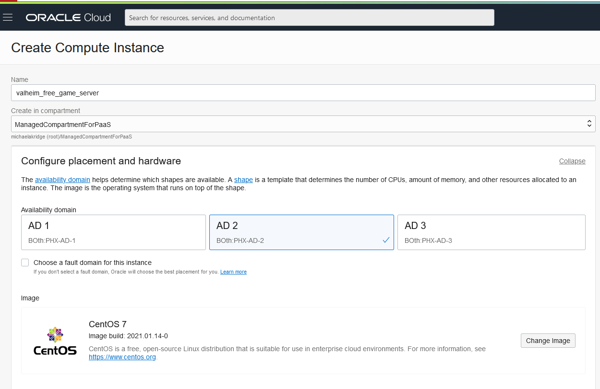
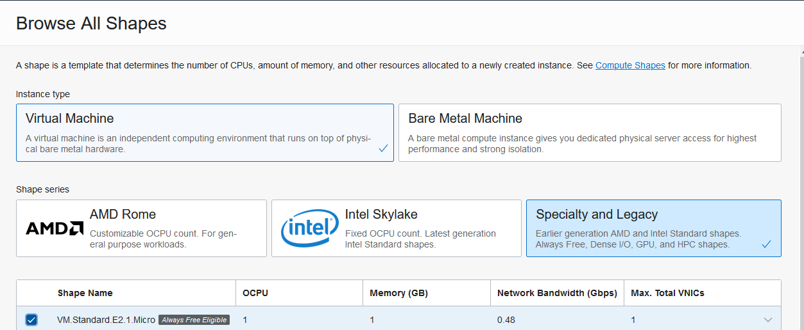


## Login to the Cloud Virtual Machine

This will be different for every operating system so check out the official Oracle documentation:
- https://docs.oracle.com/en-us/iaas/Content/Compute/Tasks/accessinginstance.htm
- I'm on Windows 10 and will use Putty(https://www.putty.org/)
### Convert private key into a putty key
First thing first is to **convert the .key private key** file downloaded above into a **putty key(.ppk)**
1.  Open PuTTYgen.
2.  Click  **Load**, and select the private key generated when you created the instance. The extension for the key file is  `.key`.
3. Enter a password for the key.
4.  Then click  **Save private key**.
5.  Specify a name for the key. The extension for new private key is  `.ppk`.
6.  Click  **Save**.

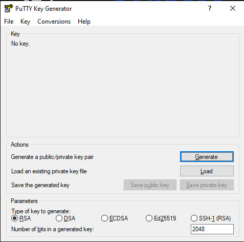
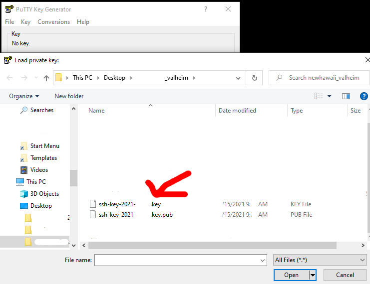

### Connect to the VM instance using the .ppk private key file
1.  Open PuTTY.
2.  On the left-hand side **Category**  pane,  select  **Session**  and enter the following:
 
    -   **Host Name (your IP address):**
    -   **Port:**  22
    -   **Connection type:**  SSH
3.  In the  **Category**  pane, expand  **Connection**, expand  **SSH**, and then click  **Auth**.
4.  Click  **Browse**, and then select your .ppk private key file.
5.  Click  **Open**  to start the session.
6.     Your Username is the default username for the instance. 
        For Oracle Linux and CentOS images, the default username is  `opc`. 
        For Ubuntu images, the default username is  `ubuntu`.
7. Password is the password for the key you just setup
* Note: First time connecting to the instance, you might see a message that the server's host key is not cached in the registry. Click  **Yes**  to continue the connection.
* 
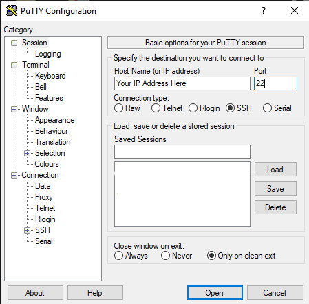

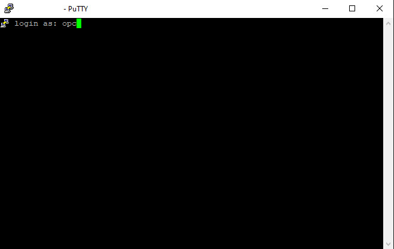
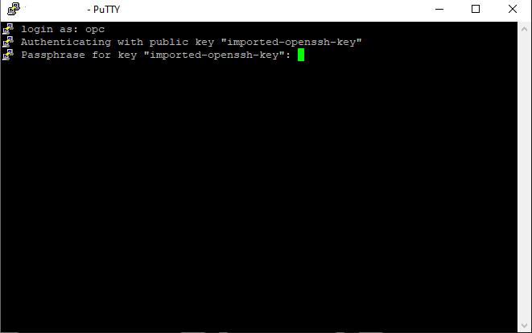
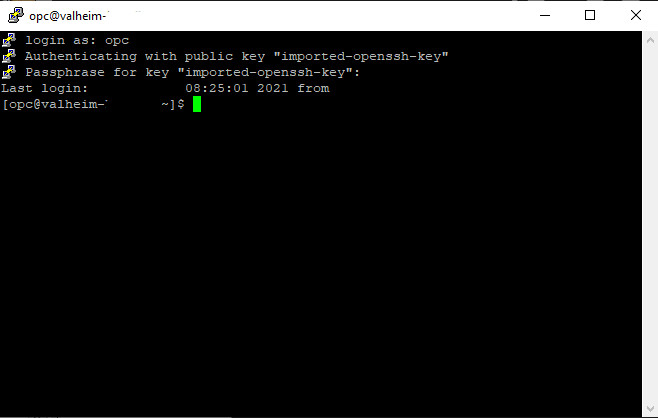
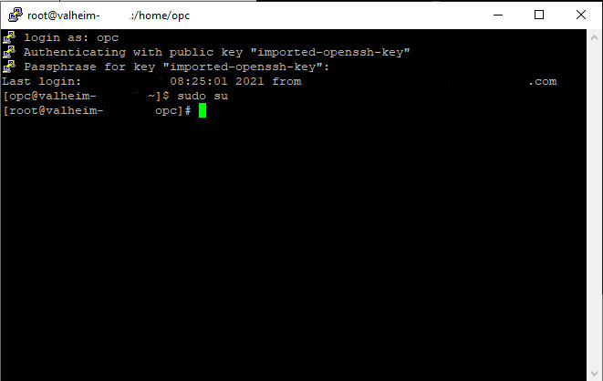

## Go ahead and setup the firewall stuff on the server and cloud account

Valheim uses the following ports, but could be changed if you want during config. 

Run the following one at a time
```
sudo firewall-cmd --permanent --zone=public --add-port=2456/udp
```
```
sudo firewall-cmd --permanent --zone=public --add-port=2457/udp
```
```
sudo firewall-cmd --reload
```

### You will also need to add the following ports to the ingess rule set


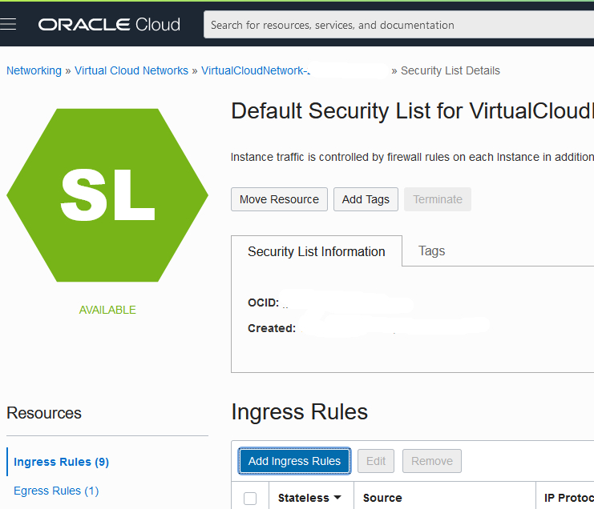
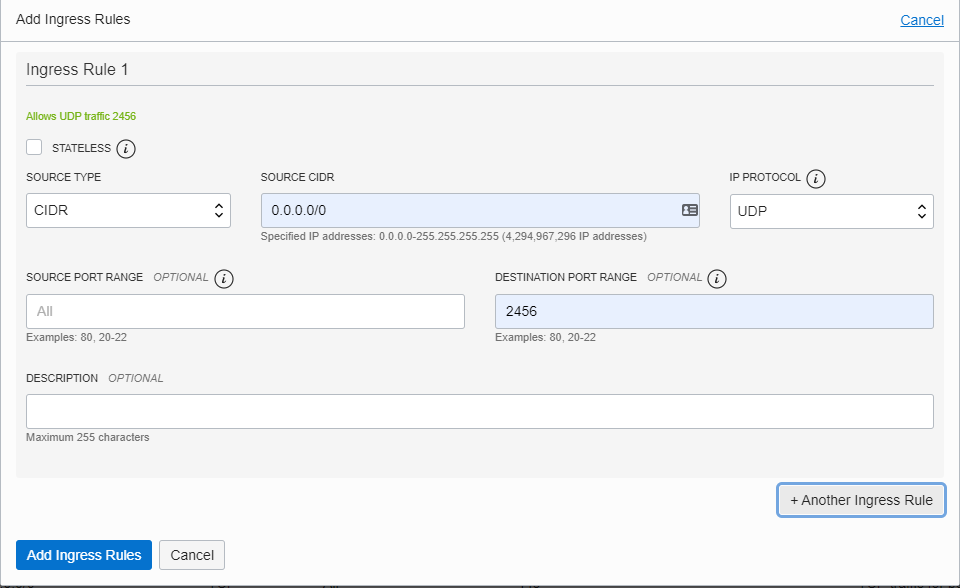
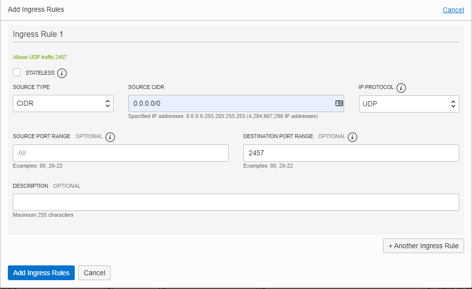
### At the end you should have the two ports added to your ingress rule set as seen below


## Method 1: Install the Linux Game Server Manager(LGSM)
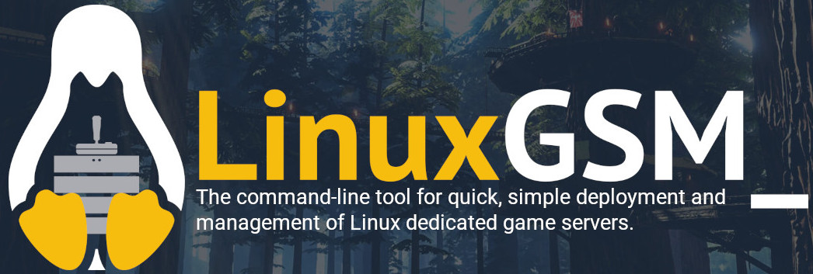
More info here: https://linuxgsm.com/lgsm/vhserver/

### Dependencies install
login
then  type the following to login as root
```
sudo su 
```
Then install the dependencies. Run the following one at a time
```
yum install epel-release
```
```
yum install curl wget tar bzip2 gzip unzip python3 binutils bc jq tmux glibc.i686 libstdc++ libstdc++.i686
```
### Install GameDig
Its a recommended additional module that allows LinuxGSM to gather more info from the game
```
curl -sL https://rpm.nodesource.com/setup_12.x | bash -
```
```
yum install nodejs
```
```
npm install gamedig -g
```
```
npm update -g
```
### Run this since it seems to be left out when installing linux game server manager
```
sudo yum install nmap-ncat
```
### Install LGSM & Use it to install Valheim

The next few steps are pretty easy. 
Create the user 
```
adduser vhserver
```
login as that user
```
su - vhserver
```
2. Download linuxgsm
```
wget -O linuxgsm.sh https://linuxgsm.sh && chmod +x linuxgsm.sh && bash linuxgsm.sh vhserver
```
3. Run the installer following the on-screen instructions.
```
./vhserver install
```
### And done with LGSM install. Now for config and daily use cases. 

### When logged into server as vhserver. Run the following to see all commands:
```
./vhserver
```
### Valheim Basic Server Command stuff
```
./vhserver start
./vhserver stop
./vhserver restart
./vhserver update
./vhserver details
./vhserver backup
./vhserver monitor
```
Once you start the server it will populate with a default config. Make sure to edit the config to give the Valheim Server a name, seed, and password: 
1. [An Example Valheim LGSM config file](#example-lgsm-valheim-config-file) 
2. [How to Migrate your Existing Valheim World](#migrate-your-existing-valheim-world) 
___
## OR Method 2: Install CubeCoders Application Management Panel(AMP)

More info at these links.
- https://cubecoders.com/AMP
- https://cubecoders.com/AMPInstall
-- **Note AMP is a paid server administration software.** 
-- But its fairly inexpensive and feature rich. I think its only like $10-ish USD.

### Install AMP 
This is their quick install command. It will walk you through all the steps and is very easy. I skipped the https stuff.
```
bash <(wget -qO- [getamp.sh](http://getamp.sh/))
```
- Also when it asks you to finish the install via AMP login, it shows you the ip/port to go check out. 
- I had to add the port 8080 to my ingess rules like in step 4 above before I could access the panel. 
- You can also skip the license and add that after. 
- Add the license key under Configuration > New Instance Defaults
 
### Install Valheim with AMP
This part is just wonderfully easy. 
- Click Instances > Create Instance 


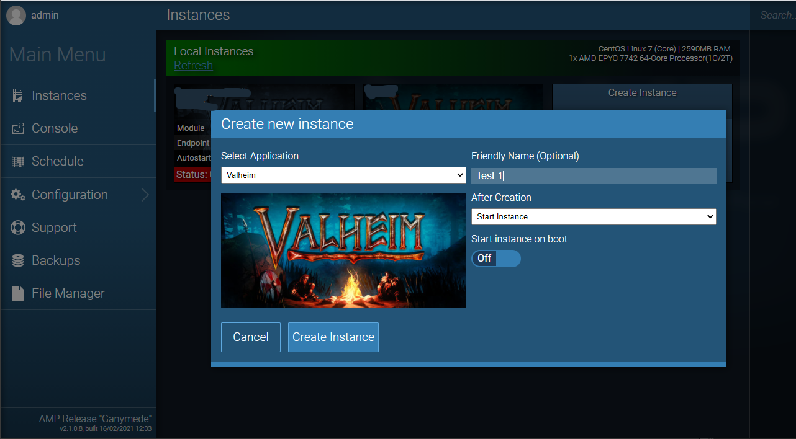
### And done. Now click on the instance you just made to view settings to change as you wish. 

### Edit Ports: These were my defaults setup by AMP.

### Edit Settings: Change as you see fit. 
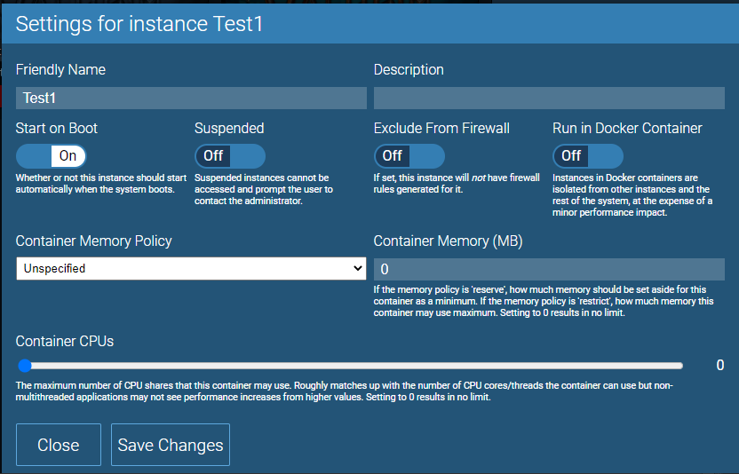
### Click Mange and you should see the following instance manage screen

### Before you start the server just make sure to give it a name and password. Also the world seed is the name of your world if you're going to migrate from non-dedicated local file. 
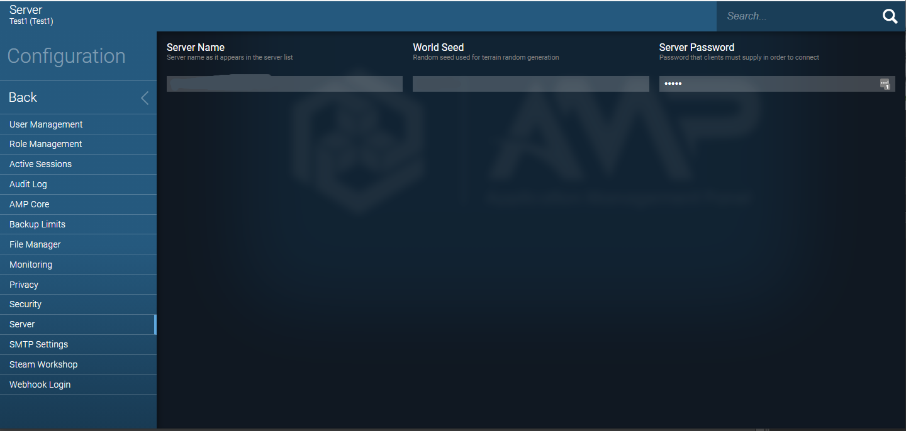
### Click start and you should see the stats start increasing. 

### This is the file browser


## Optional Setup Valheim+ Mod


## Setup the Free Network Load Balancer
This is optional but helps with network spikes and lag. In a recent update I was able to run it without it, but results may vary with regions. 


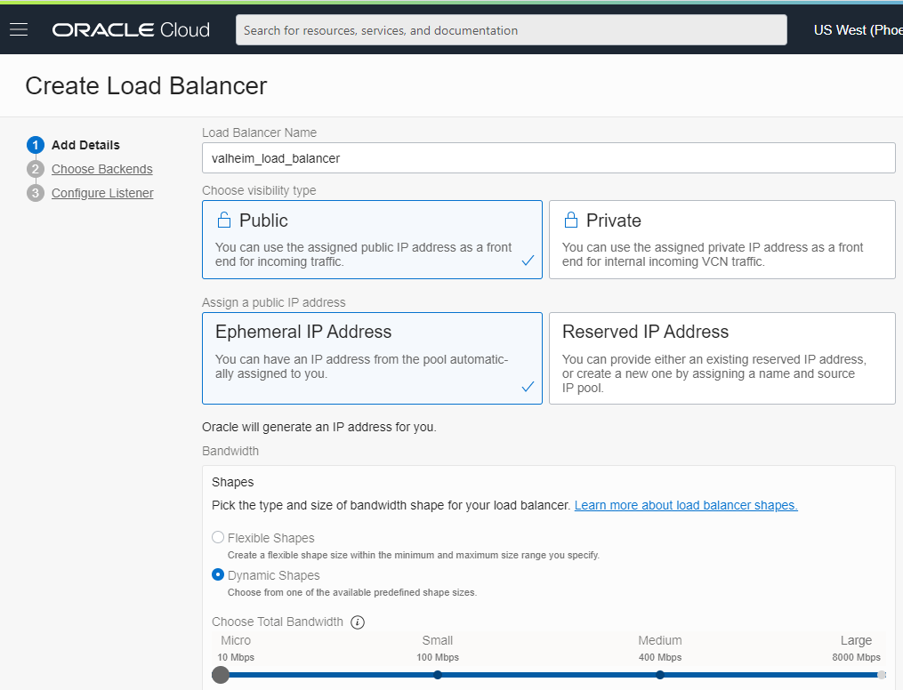


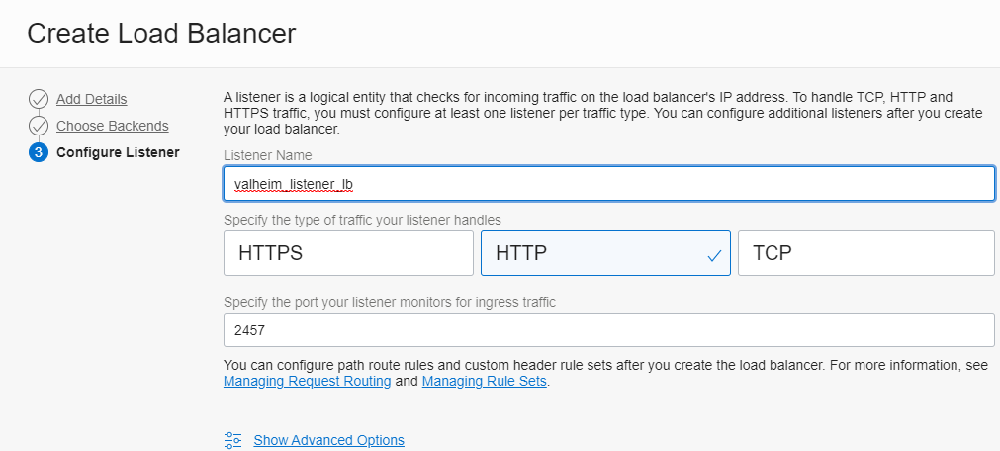

### Setup Valheim+ Mod on AMP
AMP makes things super easy again. Just create a new instance and select Valheim+ install. Then follow similar steps as above to config everything. 
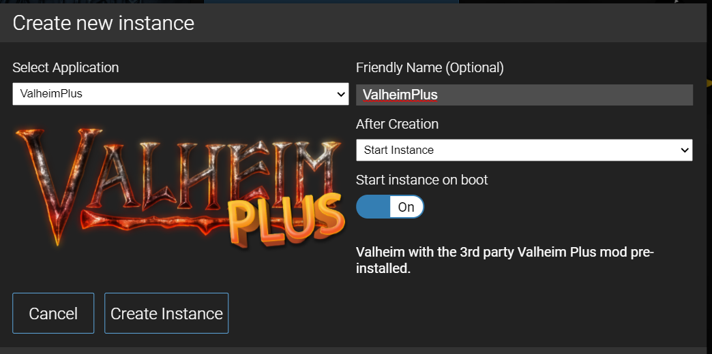

### Make sure to Setup Valheim+ on your machine as well. Download the latest package called WindowsClient.zip over at their link. (Scroll down and click "assets")
- https://github.com/nxPublic/ValheimPlus/releases/
- Locate your game folder by starting up steam and:
- Right click the valheim game in your steam library
- Go to Manage>Browse local files
- Steam should open your game folder for you when clicked
- Then just unzip everything in there

### Also edit your valheim plus server config(valheim_plus.cfg) file in BepInEx\config\valheim_plus.cfg
Change whatever you like, but for me I had to also update the following: Look for the section called server. Find my config attached for reference.
```
[Server]

; Change false to true to enable this section
enabled=false

; Modify the amount of players on your Server
maxPlayers=10

; Removes the requirement to have a server password
disableServerPassword=false

; This settings add a version control check to make sure that people that try to join your game or the server you try to join has V+ installed
enforceMod=false

; The total amount of data that the server and client can send per second in kilobyte
dataRate=60

; The interval in seconds that the game auto saves at (client only)
autoSaveInterval=1200
```

### Setup Valheim+ Mod on LGSM
For LGSM its going to take a bit more. Okay the Valheim+ Mod documentation leaves a lot to be desired to say the least. Here is what I did to set it up with LGSM.
- Link to the V+ repo: https://github.com/nxPublic/ValheimPlus

### Setup Valheim+ on your machine first. Download the latest package called WindowsClient.zip over at their link. (Scroll down and click "assets")
- https://github.com/nxPublic/ValheimPlus/releases/
- Locate your game folder by starting up steam and:
- Right click the valheim game in your steam library
- Go to Manage>Browse local files
- Steam should open your game folder for you when clicked
- Then just unzip everything in there

### Download the latest package called UnixServer.zip over at their link. (Scroll down and click "assets")
- https://github.com/nxPublic/ValheimPlus/releases/

### Go ahead and unzip it. Then edit the start_server_bepinex.sh file. I did this before uploading to the server

Scroll to the bottom of the start_server_bepinex.sh file and find the section about server and password. This is where you put in the server name, password, and world you setup in AMP.
```
./valheim_server.x86_64 -name YOURSERVERNAME -password YOURPASSWORD -port YOURPORTNUMBER -world WORLDNAME
```
### Also edit your config(valheim_plus.cfg) file in the unziped folder UnixServer\BepInEx\config\valheim_plus.cfg
Change whatever you like, but for me I had to also update the following: Look for the section called server. Find my config attached for reference.
```
[Server]

; Change false to true to enable this section
enabled=false

; Modify the amount of players on your Server
maxPlayers=10

; Removes the requirement to have a server password
disableServerPassword=false

; This settings add a version control check to make sure that people that try to join your game or the server you try to join has V+ installed
enforceMod=false

; The total amount of data that the server and client can send per second in kilobyte
dataRate=60

; The interval in seconds that the game auto saves at (client only)
autoSaveInterval=1200
```
### For LGSM, login via SFTP, you must use your Key file like in Putty. 
So to do this I used filezilla(https://filezilla-project.org/) ftp program since its free. 
Example:
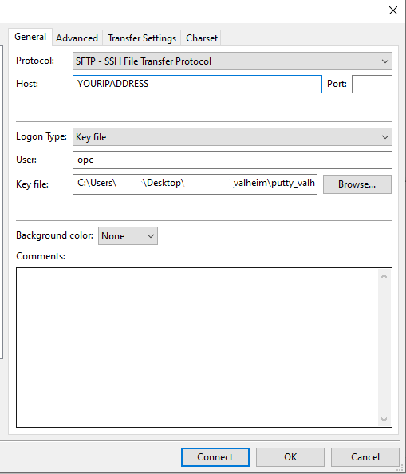

### Navigate to folder path where you install the mod:
```
/home/vhserver/serverfiles
```
### Then just drag and drop the UnixServer files over. Say okay to overwrite. 
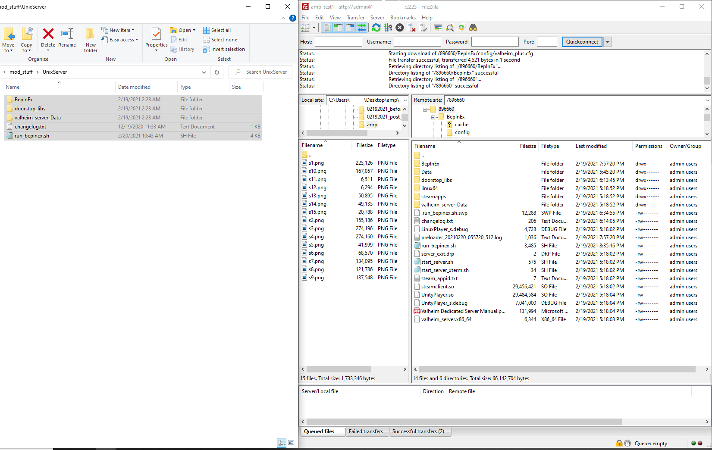

### If you have issues with moving files or running V+ due to server permissions then:
Update them via server console(putty)
LGSM 
```
sudo chmod -R ugo+rwx /home/vhserver/
```
### If the  mod does not start with the LGSM server then try doing this:
1. Edit start_server_bepinex.sh and replace the arguments of Valheim executable with $@ so the last line looks like this :
```
exec ./valheim_server.x86_64 $@
```
2. Add the following to  your vhserver.cfg
```
executable="./start_server_bepinex.sh" to your your vhserver.cfg
```
___
# Reference/FAQ

## Login to Valheim using your New Dedicated Server
- Open Steam
- Click "View" across the top. 
- Then click on "Servers" on that menu.
- A popup window will appear and select the "Favorites" tab
- Then click on the "Add a Server" button.
- Use IPAddress:2457 typically
- Hit search
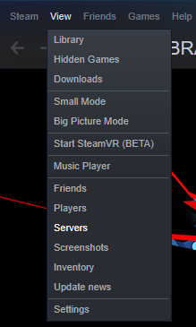
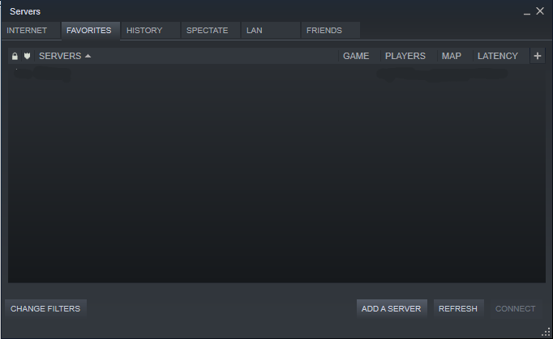
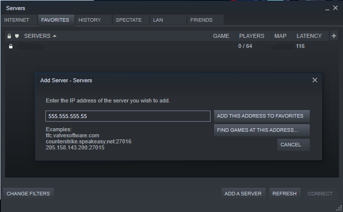
## Migrate your Existing Valheim World
Drag and drop your world file from your local drive to the server data folder using filezilla. 
### If using LGSM
Copy from local drive
```
C:\Users\yourname\AppData\LocalLow\IronGate\Valheim\worlds
```
to remote server folder
```
/home/vhserver/.config/unity3d/IronGate/Valheim/worlds
```
### If using AMP
Must be the same name as in the AMP instance mange settings. Make sure to change the path to include your name.
```
C:\Users\yourname\AppData\LocalLow\IronGate\Valheim\worlds
```
to remote server folder
```
/896660/Data/worlds
```
### If you have issues with moving files due to permissions 
Update them via server console(putty)
LGSM example
```
sudo chmod -R ugo+rw /home/vhserver/
```
AMP example
```
sudo chmod -R ugo+rwx /home/amp/
```
## How to Tell Valheim+ is Working
To check if client installed correctly just load the game and you should see the Valheim logo changed with the Valheim+ logo
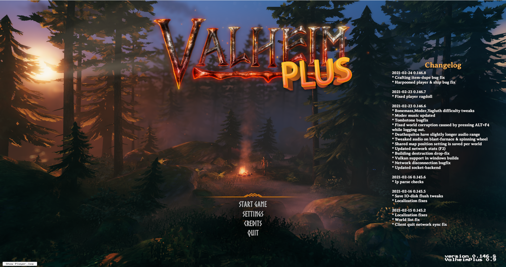
To check if server is working, once connected hit F5 for console output. It will note which version of Valheim+ is installed. 
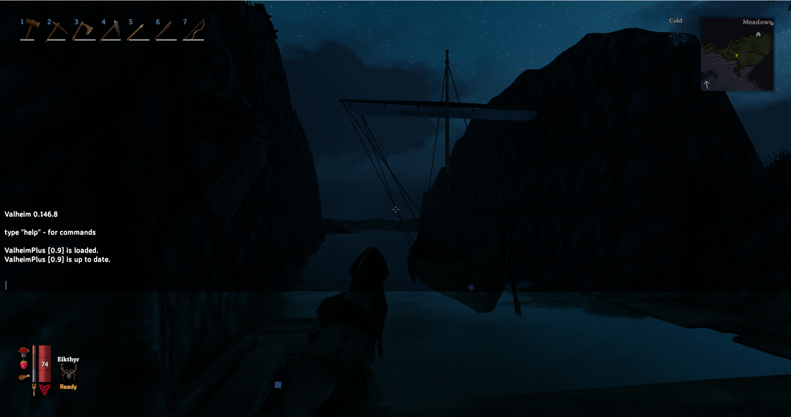

## Example LGSM Valheim config file
https://github.com/akridge/Oralce-Cloud-Free-Valheim-Game-Server-Setup/blob/main/docs/vhserver.cfg

## My Valheim+ config file
https://github.com/akridge/Oralce-Cloud-Free-Valheim-Game-Server-Setup/blob/main/docs/valheim_plus.cfg
