# Oralce-Cloud-Valheim-Game-Server-Setup-for-Free


Hopefully this helps someone get started. The free version will only be good for a couple people. 

But if you want to use your free trial credits or upgrade then I would recommend the following and its pretty much the same setup steps as below: 
| Price | Shape | CPU Core | Memory(GB) | Load Balancer |
| ----------- | ----------- | ----------- | ----------- |  ----------- |
| Free | VM.Standard.E2.1.Micro| 1 | 1 |1 w/ 10mbps|
| Paid(recommended)| VM.Standard.E3.Flex| 1 | 3|1 w/ 10mbps|

### Table of Contents
1. [Sign up for Oracle Cloud Free Tier](#sign-up-for-oracle-cloud-free-tier)
2. [Create The Virtual Machine.](#create-the-virtual-machine)
3. [Login to the Virtual Machine](#login-to-the-virtual-machine)
4. [Go ahead and setup the firewall stuff on the server and cloud account](#go-ahead-and-setup-the-firewall-stuff-on-the-server-and-cloud-account)
5. [Setup the Free Network Load Balancer](#setup-the-free-network-load-balancer)
6. [Method 1: Install the Linux Game Server Manager(LGSM)](#install-the-linux-game-server-managerlgsm)
7. [OR Method 2 Install CubeCoders Application Management Panel(AMP)](#or-install-cubecoders-application-management-panelamp)
8. [Optional Setup Valheim+ on AMP Game Instance](#setup-valheim-mod-on-amp-game-instance)
9. [Optional Reference - My Valheim+ config file](#reference---my-valheim-config-file)
10. [Optional - Migrate your world](#optional-migrate-your-world)

## Sign up for Oracle Cloud Free Tier
Link: https://www.oracle.com/cloud/free/


- Its a free trial and a free account too. 
- You won't be charged and can still use everal free services after the trail. 
- Plus they nicely label all the free stuff. 
- In this we will use 1 of the 2 free virtual machines. 

## Create The Virtual Machine

Choose the following and make sure to download the SSH keys to login in the next step. This is their free tier VM and should be okay for you and a couple buddies. 


## Login to the Virtual Machine

This will be different for every operating system so check out the offical oracle doc:
https://docs.oracle.com/en-us/iaas/Content/Compute/Tasks/accessinginstance.htm


## Go ahead and setup the firewall stuff on the server and cloud account

Valheim uses the following ports, but could be changed if you want during config. 

Run the following one at a time
```
sudo firewall-cmd --permanent --zone=public --add-port=2456/udp
```
```
sudo firewall-cmd --permanent --zone=public --add-port=2457/udp
```
```
sudo firewall-cmd --reload
```

### You will also need to add the following ports to the ingess rule set
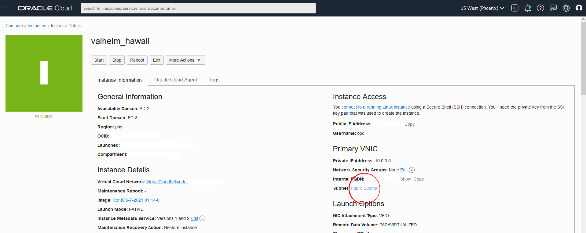


## Setup the Free Network Load Balancer
This helps with lag. 

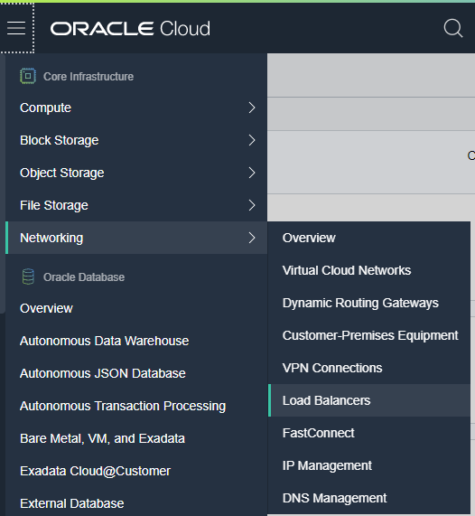


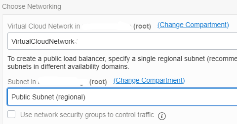
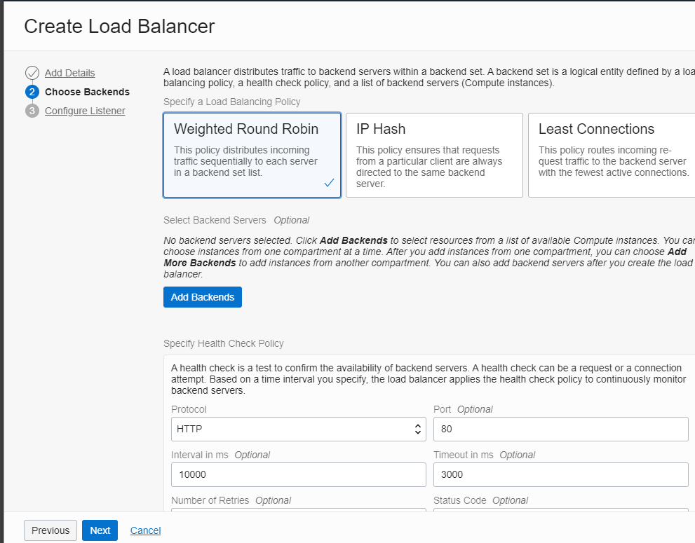
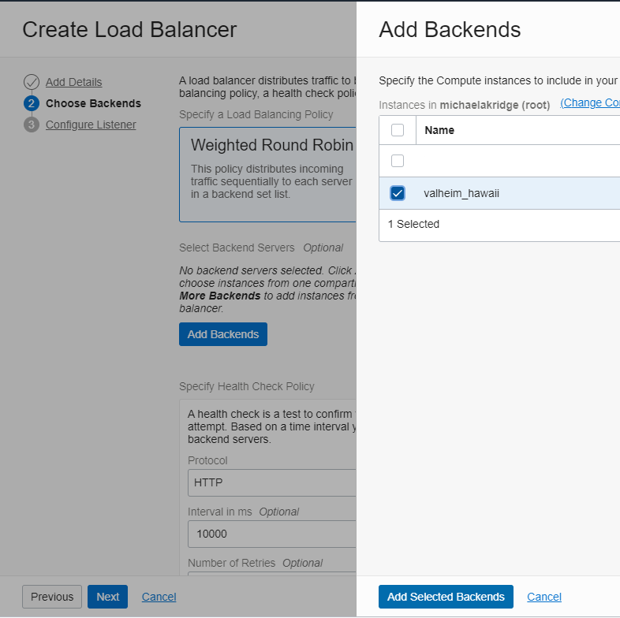


## Method 1: Install the Linux Game Server Manager(LGSM)

More info here: https://linuxgsm.com/lgsm/vhserver/

### Dependencies install
login
then  type the following to login as root
```
sudo su 
```
Then install the dependencies. Run the following one at a time
```
yum install epel-release
```
```
yum install curl wget tar bzip2 gzip unzip python3 binutils bc jq tmux glibc.i686 libstdc++ libstdc++.i686
```
### Install GameDig
Its a recommended additional module that allows LinuxGSM to gather more info from the game
```
curl -sL https://rpm.nodesource.com/setup_12.x | bash -
```
```
yum install nodejs
```
```
npm install gamedig -g
```
```
npm update -g
```
### Run this since it seems to be left out when installing linux game server manager
```
sudo yum install nmap-ncat
```
### Install LGSM & Use it to install Valheim

The next few steps are pretty easy. 
Create the user 
```
adduser vhserver
```
login as that user
```
su - vhserver
```
2. Download linuxgsm
```
wget -O linuxgsm.sh https://linuxgsm.sh && chmod +x linuxgsm.sh && bash linuxgsm.sh vhserver
```
3. Run the installer following the on-screen instructions.
```
./vhserver install
```
### And done with LGSM install. Now for config and daily use cases. 

### When logged into server as vhserver. Run the following to see all commands:
```
./vhserver
```
### Valheim Basic Server Command stuff
```
./vhserver start
./vhserver stop
./vhserver restart
./vhserver update
./vhserver details
./vhserver backup
./vhserver monitor
```
Once you start the server it will populate with a default config. Check out steps below to migrate your own world. 
___
## OR Method 2: Install CubeCoders Application Management Panel(AMP)

More info at the link: 
- https://cubecoders.com/AMP
- https://cubecoders.com/AMPInstall
-- note its paid server administration software. But its fairly inexpensive and feature rich. 

### Install AMP 
This is their quick install command. It will walk you through all the steps and is very easy. I skipped the https stuff.
```
bash <(wget -qO- [getamp.sh](http://getamp.sh/))
```
- Also when it asks you to finish the install via AMP login, it shows you the ip/port to go check out. 
- I had to add the port 8080 to my ingess rules like in step 4 above before I could access the panel. 
- You can also skip the license and add that after. 
- Add the license key under Configuration > New Instance Defaults
 
### Install Valheim with AMP
This part is just wonderfully easy. 
- Click Instances > Create Instance 


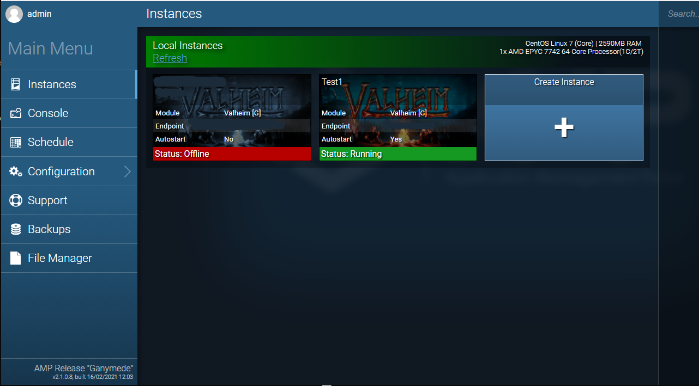
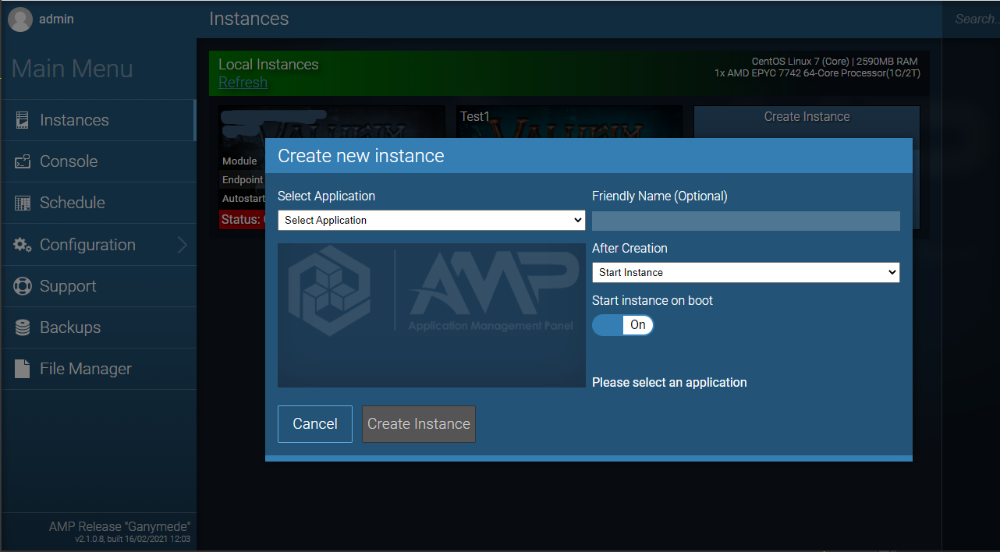

### And done. Now click on the instance you just made to view settings to change as you wish. 
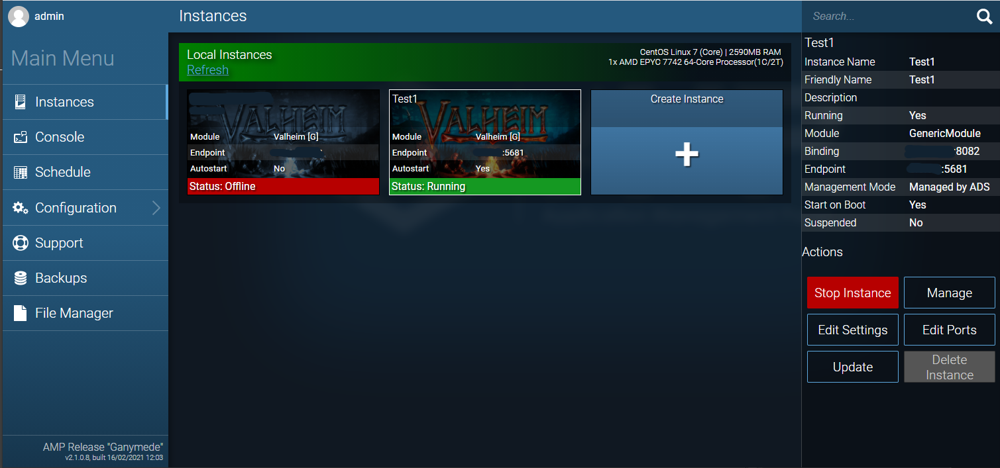
### Edit Ports: These were my defaults setup by AMP.
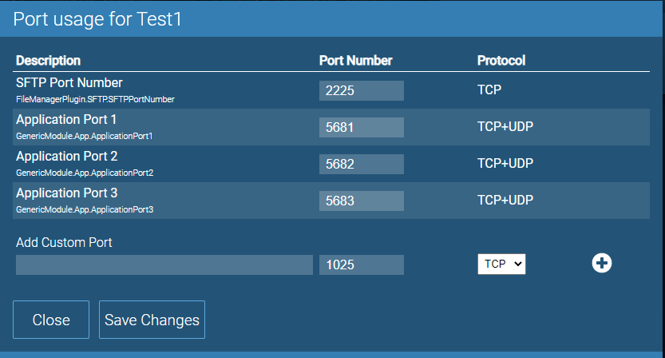
### Edit Settings: Change as you see fit. 

### Click Mange and you should see the following instance manage screen

### Before you start the server just make sure to give it a name and password. Also the world seed is the name of your world if you're going to migrate from non-dedicated local file. 

### Click start and you should see the stats start increasing. 
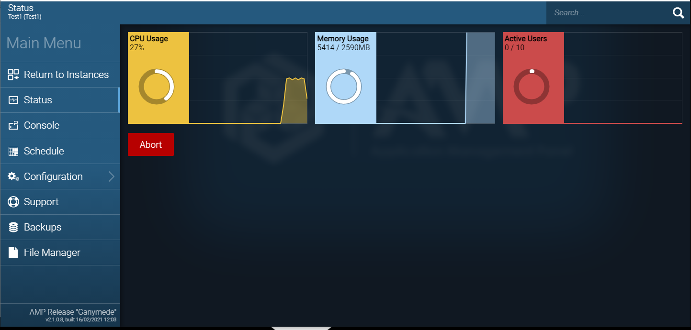
### This is the file browser
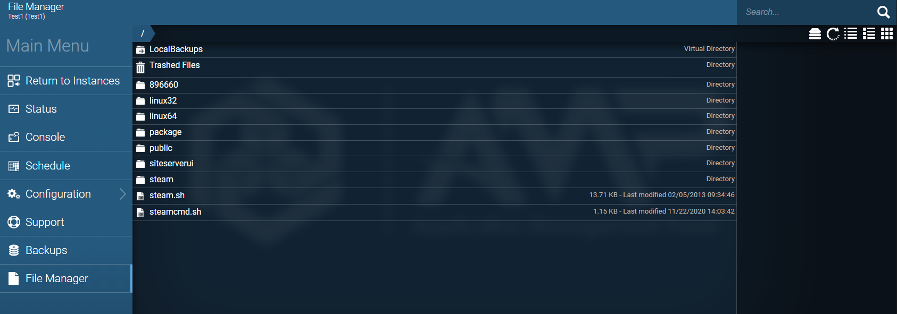

## Setup Valheim+ Mod on AMP Game Instance
Okay the Valheim+ Mod documentation leaves a lot to be desired to say the least. Here is what I did to set it up with AMP.
- Link to the repo: https://github.com/nxPublic/ValheimPlus

### Setup Valheim+ on your machine first. Download the latest package called WindowsClient.zip over at their link. (Scroll down and click "assets")
- https://github.com/nxPublic/ValheimPlus/releases/tag/0.8
- Locate your game folder by starting up steam and:
- Right click the valheim game in your steam library
- Go to Manage>Browse local files
- Steam should open your game folder for you when clicked
- Then just unzip everything in there

### Download the latest package called UnixServer.zip over at their link. (Scroll down and click "assets")
- https://github.com/nxPublic/ValheimPlus/releases/tag/0.8

### Go ahead and unzip it. Then edit the run_bepinex.sh file. I did this before uploading to the server

Scroll to the bottom of the run_bepinex.sh file and find the section about server and password. This is where you put in the server name, password, and world you setup in AMP.
```
"${PWD}/${executable_name}" -name YOURSERVERNAME -password YOURPASSWORD -nographics -batchmode -port YOURPORTNUMBER -world WORLDNAME
```
### Also edit your config(valheim_plus.cfg) file in the unziped folder UnixServer\BepInEx\config\valheim_plus.cfg
Change whatever you like, but for me I had to also update the following: Look for the section called server. Find my config attached for reference.
```
[Server]
enabled=false
; enable/disable Server changes

maxPlayers=10
; (int) default is 10

disableServerPassword=false
; (boolean) default is false

enforceConfiguration=false
; enforce every user trying to join your game or server to have the same mod configuration.
; NOTE: if people want to join your server with a custom configuration, they need to set this setting to false as well as the server.

enforceMod=false
; enforce every user to atleast have the mod installed when connecting to the server
; turn this off to remove version restrictions from your client and from your server
```

### Now Locate your AMP Instance server folder
So to do this I used filezilla(https://filezilla-project.org/) ftp program since its free. The AMP instance setup above must be running, but server can be off. 
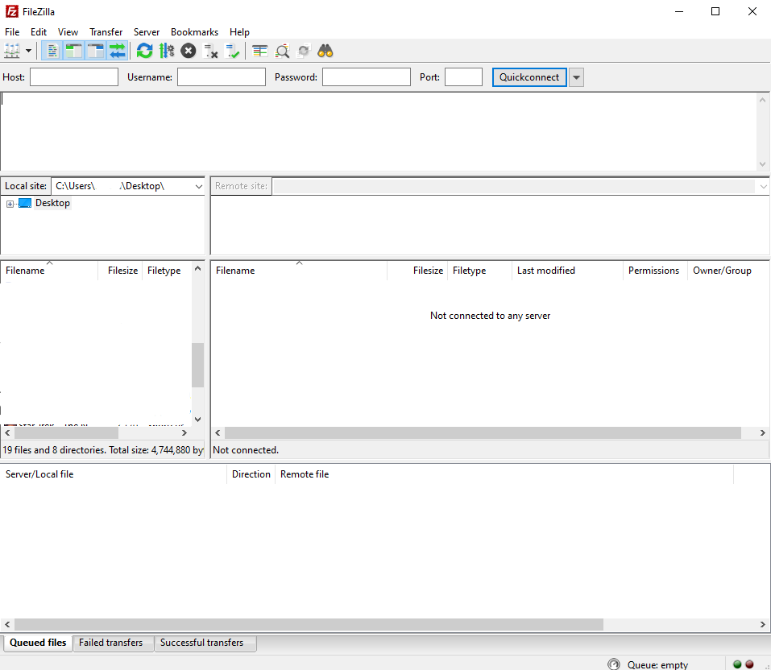
### Go to File>Site Manager
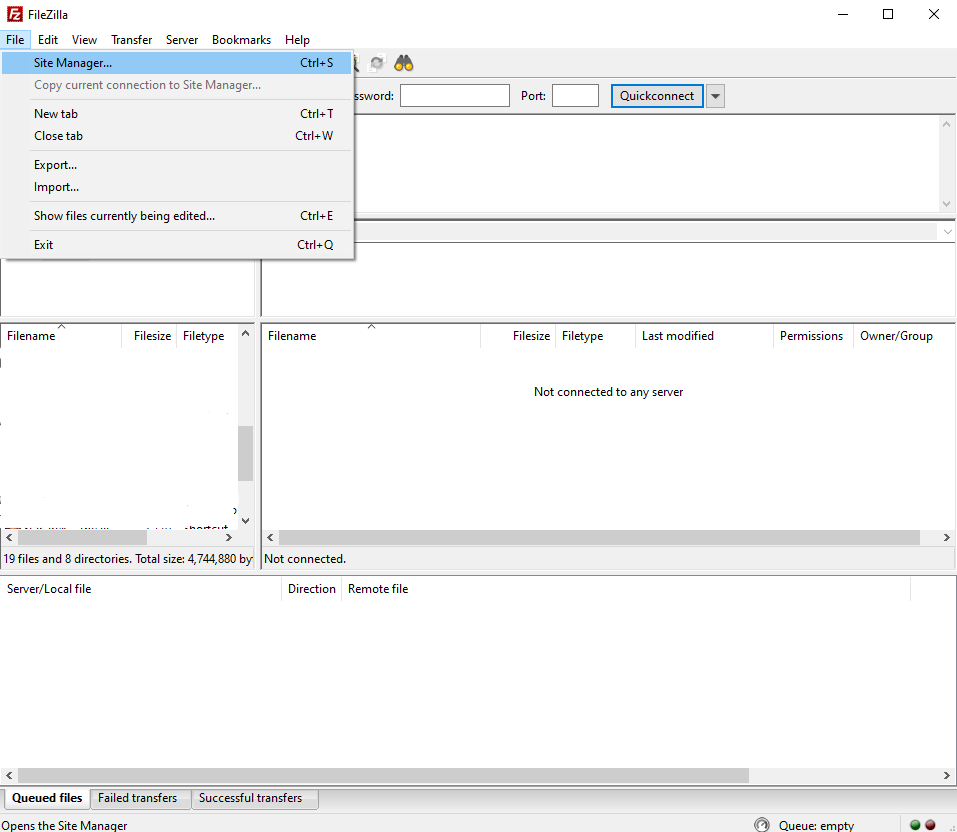
### Add new site. Host is your ip address, port is the Instance SFTP port you setup above. To find it click on instance > edit ports. To add a different instance then you just change the port and should be same IP address. 
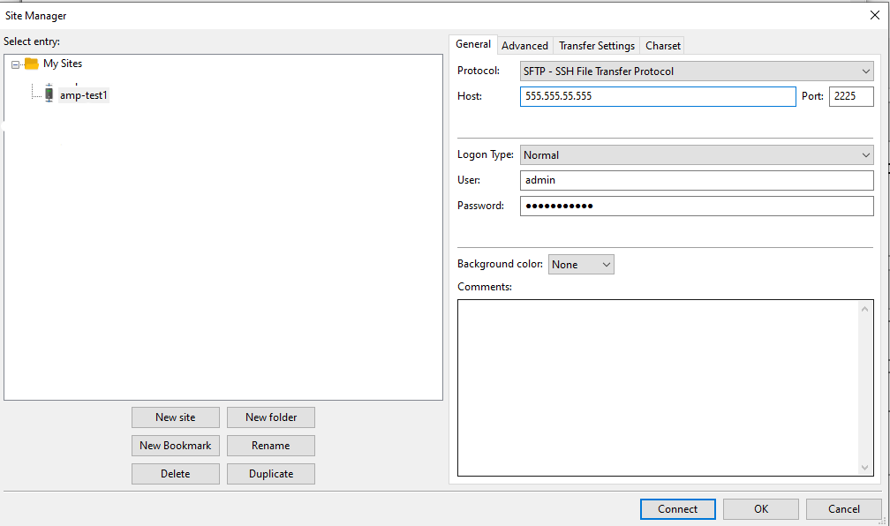
### User/Password is Admin and the password you setup for your AMP portal

### Click connect and you should see the file directory on the right side and your local files on the left. 
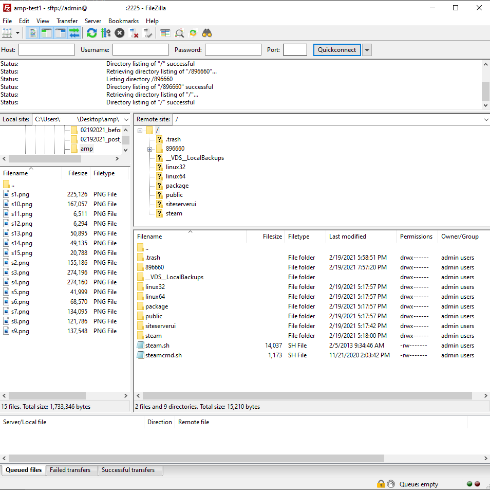
### As a close up the instance server game file are in the number folder 
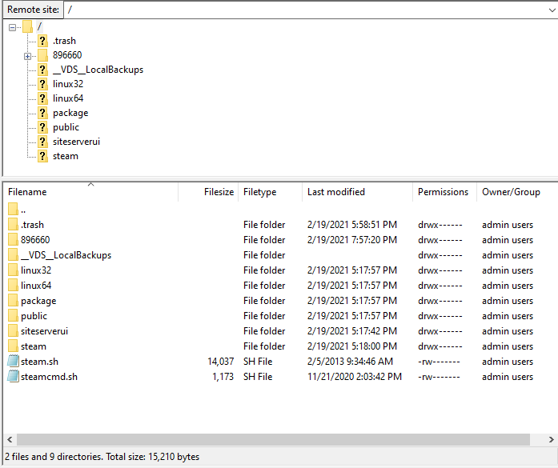
### Open that up and you see all the game files. 
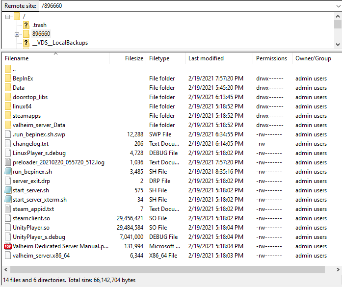
### Then just drag and drop the UnixServer files over. Say okay to overwrite. 


### Once thats done then you have to login to your server console(again I used putty) and change permissions to that run_bepinex.sh file
Make sure to change the script to include your instance name.
```
sudo su
chmod u+x /home/amp/.ampdata/instances/INSERTINSTANCENAMEHERE/Valheim/896660/run_bepinex.sh
```
### Change your working directory: 
Make sure to change the script to include your instance name.
```
cd /home/amp/.ampdata/instances/INSERTINSTANCENAMEHERE/Valheim/896660/
```
### Then run: run_bepinex.sh
```
./run_bepinex.sh
```

### Waiting for the install
So I got a bunch of errors and I wasn't the only one. But in the end it still worked. I waited like 10/15mins and eventually tried it. Here is what the errors look like and the solution was to edit the valheim_plus.cfg server stuff in the steps above. 
- https://github.com/nxPublic/ValheimPlus/issues/41


### Testing
Its good to see if it works on your standalone system first before testing the dedicated server. If your system works then just make sure you have the same valheim_plus.cfg file on both the AMP server folder and local machine. 

## Reference - My Valheim+ config file
https://github.com/akridge/Oralce-Cloud-Free-Valheim-Game-Server-Setup/blob/main/docs/valheim_plus.cfg

## Optional: Migrate your world
Drag and drop your world file from your local drive to the server data folder using filezilla. 
### If using LGSM
Copy from local drive
```
C:\Users\yourname\AppData\LocalLow\IronGate\Valheim\worlds
```
to remote server folder
```
/home/vhserver/.config/unity3d/IronGate/Valheim/worlds
```
### If using AMP
Must be the same name as in the AMP instance mange settings. Make sure to change the path to include your name.
```
C:\Users\yourname\AppData\LocalLow\IronGate\Valheim\worlds
```
to remote server folder
```
/896660/Data/worlds
```
### If you have issues with moving files due to permissions 
Update them via server console(putty)
LGSM example
```
sudo chmod -R ugo+rw /home/vhserver/
```
AMP example
```
sudo chmod -R ugo+rwx /home/amp/
```
